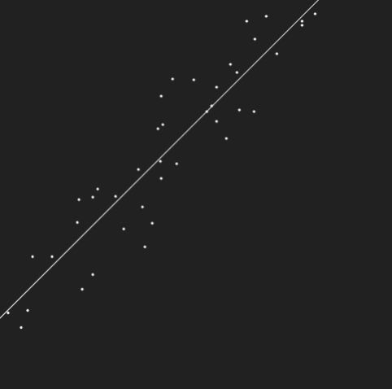

# Linear Regression

Uses a least mean squares learning rule to implement gradient descent to fit a linear function to arbitrary user data

A faster (but not interactive) example of linear regression is implemented in a [different repository of mine](https://github.com/SAXTEN2011/LinearRegression-InstantComputationPython) where the regression is instantly computed instead of using an incremental gradient descent algorithm
